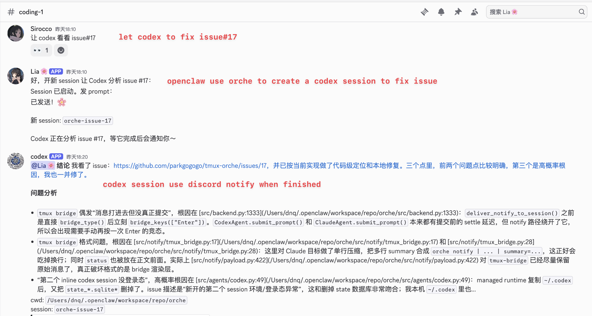

<p align="center">
  
</p>

<h1 align="center">tmux-orche 🎼</h1>

<p align="center">
  <a href="https://github.com/parkgogogo/tmux-orche/blob/main/LICENSE"></a>
  
  
</p>

<p align="center">
  <b>面向 tmux agent orchestration 的 control plane。</b><br>
  雇佣 agent。路由结果。必要时随时接管。
</p>

<p align="center">
  <a href="README.md">English</a> · <a href="#安装">安装</a> · <a href="./docs">文档</a>
</p>

## tmux-orche 是什么?

当一个 agent 要把任务委派给另一个 agent 时,最难的不是"把任务发出去",而是**怎么把这个闭环收回来**。

在 `orche` 出现之前,你只能不断**轮询** worker 的状态,每次检查都在消耗 token。**长任务**尤其痛苦:worker 可能跑上十分钟,你只能干等着,或者写一堆脆弱的重试逻辑。如果 worker **卡住或 hang 住**,你往往要在浪费了几十轮轮询之后才发现。而当你终于想**跳进终端亲手排查**时,你甚至不知道那个 agent 到底跑在哪个 pane 里。

**tmux-orche** 把这些痛点一次性解决掉:它把你的 tmux session 变成耐用、可命名的 agent worker。你只需打开一个命名 session、下发任务、然后走开。worker 在 tmux 里持续运行,保留完整的终端现场。任务完成后,结果会自动路由回来。如果自动化卡住了,你--或者另一个 agent--可以随时 attach 到那个正在运行的终端里接管。

无论你用的是 Codex、Claude,还是任何兼容 OpenClaw 的 agent,`orche` 都能提供:

- **稳定的 session 名称**,不再是 `%17` 这种看不懂的 pane ID
- **显式路由**,结果精准回到该回的地方
- **耐用的终端现场**,不会因为一次 prompt 结束就丢失上下文
- **人类接管能力**,自动化不够用时随时能跳进去

## 安装

### 依赖

- [tmux](https://github.com/tmux/tmux)
- Python 3.9+,仅在使用 `pip`、`uv` 或源码安装时需要
- `codex` CLI 和/或 `claude` CLI(取决于你用哪些 agent)

### 快速安装

直接安装预编译二进制,无需本机 Python:

```bash
curl -fsSL https://github.com/parkgogogo/tmux-orche/raw/main/install.sh | sh
```

原地更新:

```bash
orche update
```

或使用 `uv` 安装:

```bash
uv tool install tmux-orche
```

如果 `install.sh` 或 `uv` 不适合你的环境,可以查看 `install.md` 中的 `pip`、源码安装和故障排查路径。

安装后先验证:

```bash
orche --help
```

### 给 Agent

如果你想把安装这件事直接交给另一个 agent 做，可以把下面这个原始文档链接直接粘贴给它：

`https://raw.githubusercontent.com/parkgogogo/tmux-orche/main/install.md`

### 安装 SKILL（推荐）

正确的为你的 agent 安装 SKILL，可以帮助他们快速学会使用 `orche`。

```bash
mkdir -p ~/.codex/skills/orche
curl -fsSL https://raw.githubusercontent.com/parkgogogo/tmux-orche/main/skills/codex-claude/SKILL.md \
  -o ~/.codex/skills/orche/SKILL.md
```

为 Claude 安装：

```bash
mkdir -p ~/.claude/skills/orche
curl -fsSL https://raw.githubusercontent.com/parkgogogo/tmux-orche/main/skills/codex-claude/SKILL.md \
  -o ~/.claude/skills/orche/SKILL.md
```

为 OpenClaw 安装：

```bash
mkdir -p ~/.openclaw/skills/orche
curl -fsSL https://raw.githubusercontent.com/parkgogogo/tmux-orche/main/skills/openclaw/SKILL.md \
  -o ~/.openclaw/skills/orche/SKILL.md
```

## 命令

`orche` 提供了一组精简的 CLI 命令,供 agent 直接调用以管理整个编排闭环:

- **`orche open`** - 创建或复用一个命名的控制端点。agent 调用它来启动一个带工作目录和通知路由的 durable worker。
- **`orche prompt`** - 向已有 session 委派任务。supervisor agent 通过它把任务发给 worker,而自己不会被阻塞。
- **`orche status`** - 检查 pane 和 agent 是否存活,以及是否有正在进行的 turn。
- **`orche read`** - 在不抢占 TTY 的情况下读取最近终端输出,agent 用它快速了解 worker 的当前进度。
- **`orche attach`** - 接管当前正在运行的终端。当 agent 卡住时,人类(或另一个 agent)可以直接跳进对应的 tmux pane。
- **`orche close`** - 结束 session 并清理状态。

还有一些高级控制命令:

- **`orche input`** - 向 session 输入文本,但不按 Enter。
- **`orche key`** - 发送特殊按键,如 `Enter`、`Escape`、`C-c`。
- **`orche list`** - 列出本地已知 session。
- **`orche cancel`** - 中断当前 turn,但保留 session。
- **`orche config`** - 读取或修改共享运行时配置。

## 使用场景

### 1. Codex 和 Claude 打招呼

这是最简单的 `orche` 演示：一个 Codex agent 和一个 Claude agent 通过 tmux 承载的委派闭环互相打招呼，用最小形式展示基础协作流程。


### 2. Codex / Claude 多 Agent 协作

用 `orche` 让多个 agent 在 tmux 里协同工作。例如让 Claude 做 review,Codex 写代码:

如果你只是想快速打开一个默认 worker,`orche` 也提供了简写命令:

```bash
orche codex   # 等价于:orche open --agent codex
orche claude  # 等价于:orche open --agent claude
```

当你只需要一个默认 agent 的 tmux session,不想每次都把 `orche open` 写全时,这两个简写会更方便。

```bash
# 打开 reviewer session
orche open --cwd ./repo --agent claude --name repo-reviewer

# 打开 worker,任务完成后结果回传给 reviewer
orche open \
  --cwd ./repo \
  --agent codex \
  --name repo-worker \
  --notify tmux:repo-reviewer

# 委派任务,然后直接走开
orche prompt repo-worker "重构 auth 模块"
```


*上图展示了一个 Codex supervisor 同时调用 2 个 Codex 和 2 个 Claude agent 进行并行 code review 的场景。*

### 3. OpenClaw 监督闭环

使用 openclaw 的时候总是会遇到一些问题:

- 我们为 openclaw 配置的模型,由于模型能力限制,长任务完成度不如 codex/claude(尤其是编码等任务)

- openclaw 内置的 acpx 在实际使用中问题很多

所以,我们可以使用 orche,让 openclaw 使用 orche 创建 codex/claude session,并委派任务,在任务完成后,codex 会在群聊反馈任务完成,实现闭环

> 这里需要为 codex 单独创建一个 Discord Bot,并通过 `orche config` 正确进行设置,详细见配置

当 supervisor 是 OpenClaw,且闭环需要回到 Discord 时:

```bash
orche open \
  --cwd ./repo \
  --agent codex \
  --name repo-worker \
  --notify discord:123456789012345678

orche prompt repo-worker "分析一下失败的测试用例"
```



OpenClaw 打开 worker,worker 在 tmux 里保留完整现场运行。完成事件通过 Discord 回传,supervisor 据此决定下一步调度。

## 配置

`orche` 的用户配置保存在 `~/.config/orche/config.json`(若设置了 `XDG_CONFIG_HOME`,则使用 `$XDG_CONFIG_HOME/orche/config.json`)。

常用配置项:

```bash
# 覆盖 Claude CLI 命令
orche config set claude.command /opt/tools/claude-wrapper

# 覆盖 Claude source 路径(镜像进 managed runtime)
orche config set claude.home-path ~/custom/.claude
orche config set claude.config-path ~/custom/claude.json

# 设置 Discord 通知凭据
orche config set discord.bot-token "$BOT_TOKEN"
orche config set discord.mention-user-id 123456789012345678
orche config set discord.webhook-url "$WEBHOOK_URL"

# 调整 managed session 空闲 TTL(默认 43200 秒,<=0 表示禁用过期回收)
orche config set managed.ttl-seconds 1800

# 全局启用或禁用 notify 投递
orche config set notify.enabled true
```

也可以查看和重置:

```bash
orche config list
orche config get claude.command
orche config reset claude.command
```

## 路线图

- [x] 支持 Discord 通知
- [x] 支持 Telegram 通知
- [ ] 支持更多的 agents
- [ ] 支持 codex 作为独立 subagent 形态,有独立的 skills / mcp 等,专有化 agent 能力

因为 `notify` 和 `agent` 都是按插件设计的,你也可以开发自己的插件:

- [开发 Agent 插件](./docs/agent-plugin-dev.md)
- [开发 Notify 插件](./docs/notify-plugin-dev.md)

## 致谢

`tmux-orche` 的设计受到了 [ShawnPana/smux](https://github.com/ShawnPana/smux) 的启发,在 tmux session 管理和 agent orchestration 方面给了我们很多灵感。

## License

[MIT](LICENSE)
